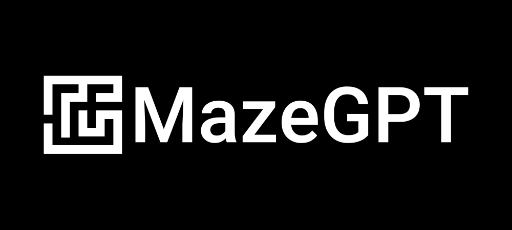

[](https://www.python.org/downloads/release/python-3110/)
[](https://GitHub.com/noah-hein/mazeGPT/releases/)

[](https://github.com/pylint-dev/pylint)
[](https://github.com/noah-hein/mazeGPT/blob/main/LICENSE)
[](https://github.com/noah-hein/mazeGPT/commits/master)
[](https://GitHub.com/noah-hein/mazeGPT/pull/)

#### Disclaimers
Does some maze generation and stuff. Working on this because I'm bored.
All this thing knows is mazes. By no means am I a master of machine learning. 
Hugging face and OpenAI are the ones to thank. They are doing the heaving lifting here.

Lots of inspiration from [NanoGPT](https://github.com/karpathy/nanoGPT) 
and [Andrej Apathy's](https://github.com/karpathy) 
great [video](https://www.youtube.com/watch?v=kCc8FmEb1nY).

|                                    |                                |
|:----------------------------------:|:------------------------------:|
|  |  |
|                                    |                                |

# 🔍 Table of Contents
* 🌅 [Introduction](#introduction)
* ⏩ [Getting Started](#-getting-started)
  * [Virtual Environment (Optional)](#virtual-environment-optional) 
  * [GPU Support (Optional)](#gpu-support-optional)
  * [Installing Dependencies](#installing-dependencies)
* 🎓 [Authors](#-authors)
* 📗 [Overview](docs/OVERVIEW.md#-overview)
  * 🌌 [Why](docs/OVERVIEW.md#-why)
  * 📐 [Representation](docs/OVERVIEW.md#-representing-a-maze)
  * 📤 [Tokenizer](docs/OVERVIEW.md#-tokenizer)
* 🏢 [Structure](docs/STRUCTURE.md#-structure)

## 🌅 Introduction
["Attention Is All You Need"](https://proceedings.neurips.cc/paper_files/paper/2017/file/3f5ee243547dee91fbd053c1c4a845aa-Paper.pdf) 
was a ground break paper in the world of machine learning in 2017.
The idea of a transformer has dramatically helped reduced the train time while improving the consistency
of attention across long periods of recurrent generation. The company [OpenAI](https://openai.com/) has two models ChatGPT and DALL·E both implementing transformers to achieve 
incredible results. 

The objective of this research project was to implement a transformer model for generating mazes. 
While there are numerous existing maze algorithms that perform well, they tend to produce recurrent patterns despite 
being seeded randomly. The goal is to achieve mazes that are more random and chaotic in nature and mimic human behavior.

For more detailed information visit the [Overview](docs/OVERVIEW.md)

## ⏩ Getting Started

### Installation
Below are the steps you should follow in order to set up the project environment.
If you are familiar with venv and PyTorch the installation section can be skipped.

#### Virtual Environment (Optional)
I recommend creating a virtual python environment to contain the dependencies for the project. Although this is not
required, it will make bootstrapping the project far easier.

Run the following to create an environment named venv
```bash
python -m venv venv       # Creates virtual env
.\venv\Scripts\activate   # Activate venv
```

#### GPU Support (Optional)
This project primary uses Huggingface Transformers to handle configure a lot of the model / training logic.
Under the hood it is using PyTorch (this could be changed for Tensorflow). Torch must be installed to run the trainer.

By default, the CPU variant of PyTorch will be installed when bootstrapping. If you have a GPU I highly recommend
using it. Transformer models are not fast with a CPU.

To install the GPU variant vist [PyTorch Getting Started](https://pytorch.org/get-started/locally/)

```bash
# Example command for PyTorch CUDA 11.8 Windows
pip3 install torch torchvision torchaudio --index-url https://download.pytorch.org/whl/cu118
```

#### Installing Dependencies
To install all the required dependencies run the following.
```bash
pip install .
```

### Usage

#### Config
Each script within the project requires the MazeAIConfig. This class can be extended and modified to suite your needs.
Visit the config module to see the default example.

When creating a config make sure to add it to the [mazegpt.py](/mazegpt.py) AVAILABLE_CONFIGS dictionary so it is
accessible to the [CLI](#cli)

```python
AVAILABLE_CONFIGS: dict[str, Type[MazeAIConfig]] = {
    "default": MazeAIConfig,
    "foobar": FoobarConfig
}
```

#### Scripts
The main scrips are prepare.py, train.py, and sample.py. Each file can be run individually to preform there intended
operation, but pay attention to the configuration passed in.

Below is an example of the bottom of prepare.py
```python
if __name__ == '__main__':
    """Allows you to run the train script without the CLI"""
    MazeAIData(MazeAIConfig())
```
The main method allows you to run the script invidually, but requires manual modification of the config.
As stated above you can extend the configuration and provide your own.

To run the modules simply do
```bash
# Examples
python -m src.prepare
python -m src.train
python -m src.sample
```


#### CLI
For simplicity each project script has been wrapped in a simplistic [CLI](/mazegpt.py) from the 
[Click](https://click.palletsprojects.com/en/8.1.x/) library. The benefit from doing this is the ability to select
different configuration via the CLI per script.


## 🎓 Authors
- Noah Hein ([@noah-hein](https://github.com/noah-hein))


