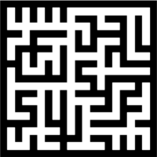
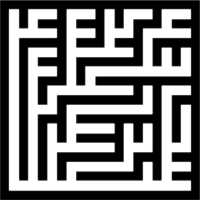
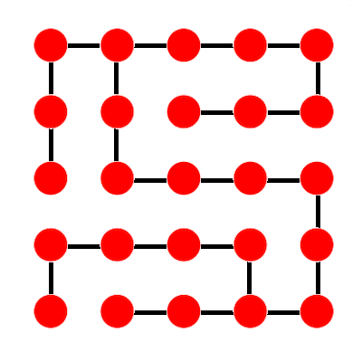

## 📗 Overview
Recursive language models specifically transformers are very good at generating out semi-related strings.
The purpose of this experiment is to determine if this model could be applied to a more rigid two-dimensional
continuous structure.

### 🌌 Why
There are plenty of maze algorithms already out there that do a decent job at generating perfect maze.
The problem with these algorithms is that even with noise and different seeds, recognizable patterns form.

|                       Prims                        |                             Binary Tree                              |
|:--------------------------------------------------:|:--------------------------------------------------------------------:|
|  |  |
|  |  |
|  |  |

As you might begin to see, the used algorithms almost have a unique characteristic to them.
To the human eye these patterns become easily aparent at a distance. I've noticed this effect still holding
true no matter the size of the maze.

The idea would be to generate and train the network on thousands of mazes.
By doing this, hopefully the algorithm will learn how to make different segments and their relative relationships.
The end goal is to make a more human like design pattern, one without a fingerprint.

### 📐 Representing a Maze
The easiest approach to representing a maze is with graph theory!
Each node in the graph can be thought of as a junction within the maze.



The focus of this project will be around perfect mazes. A perfect maze is the same as a spanning tree.
In fact several already existing algorithms use this principal for generation.

Perfect Maze Definition:
- No cycles
- No unfilled spaces (within the bounds)
- No matter where you start / end, there should only be one path


For storage purposes we will represent the structure as a two-dimensional matrix.
Each node in the maze (excluding the metadata nodes) can be represented as a 0 or 1.

### 📤 Tokenizer
So you might be asking "How the hell do you represent a graph with characters?"

For the sake of simplicity I've decided to go with an approach similar to binary (for now)
The encoding is as follows.

Encoding:
- 0 = path
- 1 = wall
- 2 = new line


Since this is a very simple recurrent neural network, 
it operates in a linear fashion (Instead of in a higher dimension).
The maze can now be interpreted as a string of tokens, nice!

#### Example
##### Image

##### Matrix
```text
[ 1 1 1 1 1 1 1 1 1 1 1 ]
[ 1 0 0 0 0 0 0 0 1 0 1 ]
[ 1 0 1 0 1 1 1 0 1 0 1 ]
[ 1 0 1 0 0 0 1 0 1 0 1 ]
[ 1 0 1 1 1 0 1 0 1 0 1 ]
[ 1 0 1 0 1 0 1 0 1 0 1 ]
[ 1 0 1 0 1 0 1 1 1 0 1 ]
[ 1 0 1 0 1 0 0 0 1 0 1 ]
[ 1 0 1 0 1 0 1 0 1 0 1 ]
[ 1 0 0 0 1 0 1 0 0 0 1 ]
[ 1 1 1 1 1 1 1 1 1 1 1 ]
```
##### Encoding
111111111112100000001012101011101012101000101012101110101012101010101012101010111012101010001012101010101012100010100012111111111112


## Future Stuff
In the future this could be expanded upon to allow for whitespace. This could potentially allow for
mazes of different shapes. I would also like to try and tackle a non box like three-dimensional maze 
(similar to a graph). Maybe somehow devise a way to spit out a vector representing the new nodes' location
or add another token to represent empty space, this way mazes of different shapes could be created.

